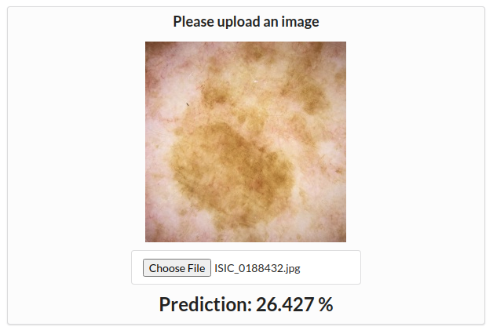

<h1 align="center">Melanoma Detector Web App</h1>
# Melanoma Detector Web App



## Backend
Flask RESTful API serves a PyTorch model at http://localhost:8000/predict. Given an input image, it predicts the probability the lesion is malignant.

## Frontend
A minimal React frontend at http://localhost:3000 that makes POST requests to the backend when the input image changes.

## Install
The following command pulls the images from Dockerhub according to docker-compose.yml.
```
docker-compose upp
```
